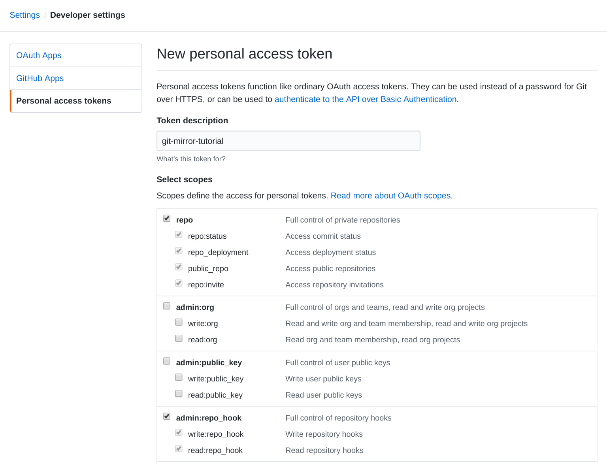

authors: Petr Shevtsov
summary: Mirror private GitHub repository to Google Cloud Platform Source Repositories without using Google Cloud Platform console
id: mirror-github-to-gcp-source-repos
categories: git
environments: web
status: draft
analytics account: 0
tags: cli, git, github, private repo, mirror repo, gcp, source repositories

# Mirror private GitHub repository to Cloud Source Repositories

## Overview
Duration: 0:10

In this codelab you will crate a Cloud Source Repository to mirror a private GitHub repository to your Google Cloud Platform project and also provision a GitHub webhook to keep repositories synchronized.

## Prerequisites
Duration: 0:10

In this section you will set up the necessary services and client tools required to complete this codelab.

### Services

- [GitHub](https://github.com/)
- [Google Cloud Platform](https://cloud.google.com/)

### Client Tools

- [git](https://git-scm.com/downloads)
- [gcloud](https://cloud.google.com/sdk)

## Prepare a Private GitHub Repository
Duration: 0:10

In this section you will prepare or create a new **private** GitHub repository.

[Create a new GitHub repository](https://github.com/new), don't forget to check **Private** and **Initilize this repository with a README**.

Negative
: If you're going to use the **existing** private GitHub repository for this codelab, make sure that your GitHub user has **admin** permissions for that repository. Such permissions are needed to install GitHub webhooks.

Let's store the name of the GitHub repository in the `GITHUB_REPO` environment variable:

```console
GITHUB_REPO="<github-username>/<github-repo>"
``` 

## Create a New Google Cloud Platform Project
Duration: 0:10

In this section you will create a new Google Cloud Platform project and adjust some configurations.

Create a new Google Cloud Platform project named `git-mirror-codelab` and capture the project ID in the `PROJECT_ID` environment variable:

```console
PROJECT_ID=$(gcloud projects create \
  --name "git-mirror-codelab" \
  --quiet --set-as-default \
  --format='value(projectId)') 
```

Ensure the default credentials are available on your local machine:

```console
gcloud auth application-default login
```

Enable the required Google Cloud Platform APIs:

```console
gcloud services enable --async \
  sourcerepo.googleapis.com \
  cloudfunctions.googleapis.com \
```

Link a billing account to the `git-mirror-codelab` project as described here: [Modify a Project's Billing Settings](https://cloud.google.com/billing/docs/how-to/modify-project).

## Generate a GitHub API Token

In this section you will generate a [GitHub API Token](https://github.com/blog/1509-personal-api-tokens) which will be used to automate the GitHub related tasks throughtout this codelab.

Generate a GitHub token using the official [guide](https://github.com/blog/1509-personal-api-tokens). While creating the token, set the token description to “git-mirror-codelab”, and check the `repo` and `admin:repo_hook` scopes.



Write the token to the `.git-mirror-codelab-github-api-token` file in the current directory:

```console
echo -n "<token>" > .git-mirror-codelab-github-api-token
export GITHUB_TOKEN=$(cat .git-mirror-codelab-github-api-token)
```

Your GitHub username will be used to automate GitHub related tasks including creating [GitHub webhooks](https://developer.github.com/webhooks/). Save your GitHub username in the `GITHUB_USERNAME` environment variable:

```console
export GITHUB_USERNAME="<github-username>"
```

## Mirror GitHub repository to Cloud Source Repositories
Duration: 0:10

In this section you will create the Cloud Source Repository that will mirror the GitHub private repository.

Create a Cloud Source Repository to mirror GitHub private reposotory, then perform the initial synchronization:

```console
repo=$(basename $GITHUB_REPO)
gcloud source repos create ${repo}
git clone --mirror https://${GITHUB_TOKEN}@github.com/${GITHUB_REPO}
git --git-dir ${repo}.git push --mirror \
  --repo "https://source.developers.google.com/p/${PROJECT_ID}/r/${repo}"
rm -rf ${repo}.git
```

At this point the GitHub private repository is mirrored to your Cloud Source Repositories.

To keep the Cloud Source repository synchronized you need to deploy the `reposync` webhook to your project.

## Deploy the Repo Sync Webhook
Duration: 0:10

In this section you will use [Google Cloud Functions](https://cloud.google.com/functions/) to host the [reposync](https://github.com/severus/reposync) webhook to keep the Cloud Source Repository in sync with the correcponding GitHub repository.

Clone the `reposync` cloud function:

```console
git clone https://github.com/severus/reposync.git
``` 

Deploy the `reposync` cloud function:

```console
gcloud functions deploy reposync \
  --source reposync \
  --entry-point F \
  --set-env-vars "GITHUB_TOKEN=${GITHUB_TOKEN}" \
  --runtime go111 \
  --trigger-http
```

## Create the GitHub webhook
Duration: 0:10

In this section you will configure the private GitHub repository to send [push events](https://developer.github.com/webhooks/#events) to the `reposync` webhook.

Retrieve the `reposync` webhook URL from the Cloud Functions API:

```console
WEBHOOK_URL=$(gcloud functions describe reposync \
  --format='value(httpsTrigger.url)')
```

Create a webhook configuration payload as defined in the [GitHub Webhooks API guide](https://developer.github.com/v3/repos/hooks/#create-a-hook):

```console
cat <<EOF > github-webhook-config.json
{
  "name": "web",
  "active": true,
  "events": [
    "push"
  ],

  "config": {
    "secret": "reposync",
    "url": "${WEBHOOK_URL}",
    "content_type": "json"
  }
}
EOF
```

Create a webhook on the GitHub repository using the `github-webhook-config.json` webhook configuration payload:

```console
curl -X POST "https://api.github.com/repos/${GITHUB_REPO}/hooks" \
  -H "Content-Type: application/json" \
  -H "Accept: application/vnd.github.v3+json" \
  -u "${GITHUB_USERNAME}:${GITHUB_TOKEN}" \
  --data-binary @github-webhook-config.json
```

The GitHub repository is now set to send push events to the `reposync` webhook.

## Cleanup
Duration: 0:01

Delete a Google Cloud Platform project:

```console
gcloud projects delete $PROJECT_ID
```
